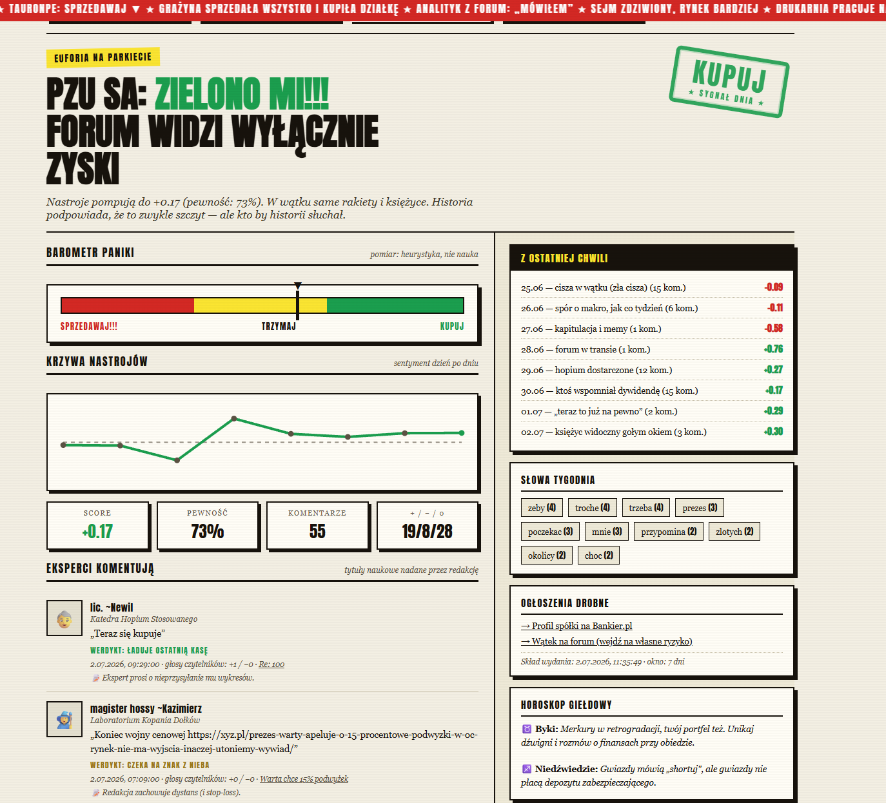

# Bankier Street Bets

[](#project-status)
[](https://github.com/110kc3/bankier-street-bets/actions/workflows/test.yml)
[](LICENSE)

A satirical **Buy / Hold / Sell** signal generator for Polish stocks, powered by heuristic sentiment analysis of retail-investor comments from the [Bankier.pl](https://www.bankier.pl) forum. Fully static — GitHub Actions scrapes and scores the data, GitHub Pages serves the front page styled like a vintage tabloid.

> ⚠️ **Not investment advice.** This is a tongue-in-cheek experiment in measuring forum "hopium". The stock horoscope section should make that clear.



## Project status

The project is feature-complete and **no longer actively developed**. It works as of mid-2026, but the scraper depends on Bankier.pl's unofficial mobile endpoints and markup — if those change, the collector will need updating. Issues and PRs may not get a response.

## How it works

- You type a WSE ticker, e.g. `EUVIC` — the frontend loads a prebuilt `data/stocks/EUVIC.json`
- A GitHub Actions workflow refreshes the JSON files with a Node.js scraper
- The collector gathers **all forum comments from the last N days** (default 7, up to 200 comments total, 200 posts per thread), paginating thread lists and posts and fetching full post bodies plus community votes (+/−)
- Quiet forums automatically widen the window (7 → 30 → 90 → 365 days) until a minimum comment count is reached (default 30; tunable via `MIN_COMMENTS` / `MAX_COMMENTS` or CLI args)
- Sentiment is scored heuristically: a lexicon of Polish word stems (inflections and missing diacritics are fine), negation handling ("nie kupuj"), multi-word phrases, emoji, and forum slang
- The Buy/Hold/Sell signal is a weighted average — fresher comments and comments with a positive vote balance count more
- Output also includes a daily sentiment trend, a positive/negative/neutral breakdown, and keywords of the week

## Running locally

```bash
npm run serve
```

Then open `http://localhost:4173`.

## Refreshing data locally

One stock (args: days back, min comments, max comments):

```bash
npm run refresh:one -- EUVIC 7 30 200
```

All stocks from `config/stocks.json`:

```bash
npm run refresh
```

Or the built-in top-20 WSE preset (no `config/stocks.json` needed):

```bash
node scripts/refresh-all.js 7 top20
```

### Environment variables

The scripts also read configuration from env vars (useful in CI):

| Variable | Default | Meaning |
| --- | --- | --- |
| `WINDOW_DAYS` | `7` | how many days back to collect comments |
| `MIN_COMMENTS` | `30` | minimum comment count; below it the window grows 7 → 30 → 90 → 365 days |
| `MAX_COMMENTS` | `200` | maximum stored comments per stock |
| `STOCK_PRESET` | `configured` | `configured` (from `config/stocks.json`) or `top20` |
| `STOCK_SYMBOL` | – | refresh a single symbol only |

## Tests and lint

```bash
npm test     # unit tests (collector, sentiment, data contract, frontend in jsdom)
npm run lint # ESLint
```

`tests/data-contract.test.js` validates the generated `data/` files and runs in the `refresh-data.yml` workflow **before** committing — a broken scrape never reaches production. `test.yml` runs lint + the full test suite on every PR.

## How the scraping works (and what breaks it)

The collector (`scripts/bankier.js`) uses Bankier's unofficial mobile endpoints:

- `…/profile/quote.html?symbol=SYMBOL` — company name and canonical forum URL
- `m.bankier.pl/forum/spolka/SYMBOL` — `data-forum-id` / `data-far-id` (forum metadata)
- `m.bankier.pl/json/get_threads` — thread list (paginated)
- `m.bankier.pl/json/get_thread` — posts in a thread, with votes (+/−)

Every fetch has a timeout (`REQUEST_TIMEOUT_MS`) and retries with backoff. If Bankier changes its markup or these endpoints, the parser needs an update — the data-contract test will catch empty or broken results in CI.

## Known limitations

- This is a heuristic lexicon, not an ML model — and definitely not an investment recommendation
- The parser depends on Bankier.pl's current HTML and may break if the site changes
- Some pages are hard to scrape; the repo includes a sample snapshot for `EUVIC` as a fallback

## Deployment (GitHub Pages)

1. Push to `main` on a GitHub repo.
2. Enable **GitHub Pages** with **GitHub Actions** as the source.
3. `deploy-pages.yml` publishes the site.
4. `refresh-data.yml` periodically refreshes the files in `data/`.

## Adding new tickers

Edit `config/stocks.json`, e.g.:

```json
[
  "EUVIC",
  "KGHM",
  "PKNORLEN"
]
```

Then run the refresh workflow or a local `npm run refresh`.

## License

MIT — see [`LICENSE`](LICENSE).
